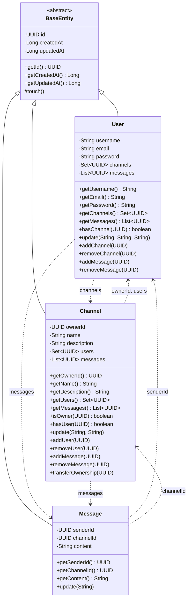
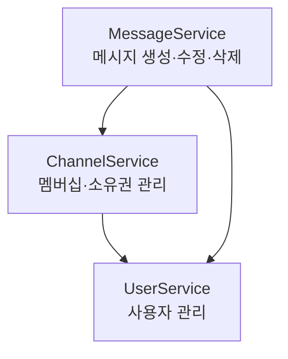

## 요구사항

## 클래스 다이어그램

```mermaid
classDiagram
    direction TB

    class BaseEntity {
        <<abstract>>
        -UUID id
        -Long createdAt
        -Long updatedAt
        +getId() UUID
        +getCreatedAt() Long
        +getUpdatedAt() Long
        #touch()
    }

    class User {
        -String username
        -String email
        -String password
        -Set~UUID~ channels
        -List~UUID~ messages
        +getUsername() String
        +getEmail() String
        +getPassword() String
        +getChannels() Set~UUID~
        +getMessages() List~UUID~
        +hasChannel(UUID) boolean
        +update(String, String, String)
        +addChannel(UUID)
        +removeChannel(UUID)
        +addMessage(UUID)
        +removeMessage(UUID)
    }

    class Channel {
        -UUID ownerId
        -String name
        -String description
        -Set~UUID~ users
        -List~UUID~ messages
        +getOwnerId() UUID
        +getName() String
        +getDescription() String
        +getUsers() Set~UUID~
        +getMessages() List~UUID~
        +isOwner(UUID) boolean
        +hasUser(UUID) boolean
        +update(String, String)
        +addUser(UUID)
        +removeUser(UUID)
        +addMessage(UUID)
        +removeMessage(UUID)
        +transferOwnership(UUID)
    }

    class Message {
        -UUID senderId
        -UUID channelId
        -String content
        +getSenderId() UUID
        +getChannelId() UUID
        +getContent() String
        +update(String)
    }

    BaseEntity <|-- User
    BaseEntity <|-- Channel
    BaseEntity <|-- Message

    User ..> Channel : channels
    User ..> Message : messages
    Channel ..> User : ownerId, users
    Channel ..> Message : messages
    Message ..> User : senderId
    Message ..> Channel : channelId
```

## 시퀀스 다이어그램

## Service 간 의존 방향

MessageService → ChannelService → UserService
       

```mermaid
flowchart TD
    MS[MessageService<br/>메시지 생성·수정·삭제] --> CS[ChannelService<br/>멤버십·소유권 관리]
    CS --> US[UserService<br/>사용자 관리]
    MS --> US
```
